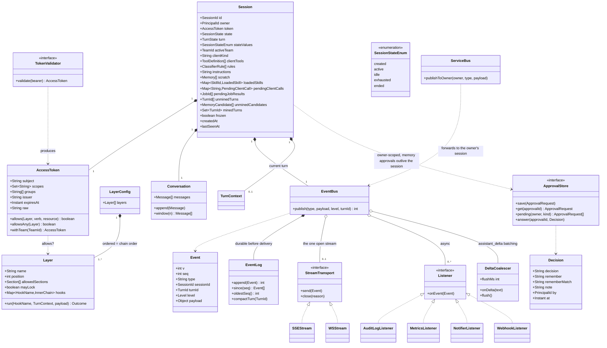
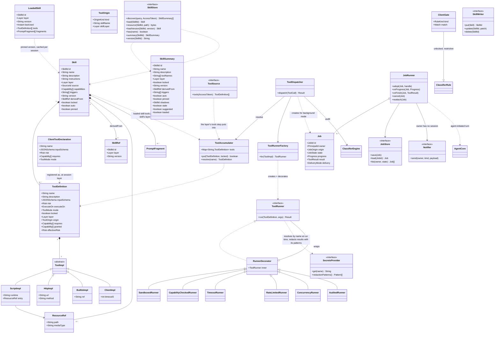
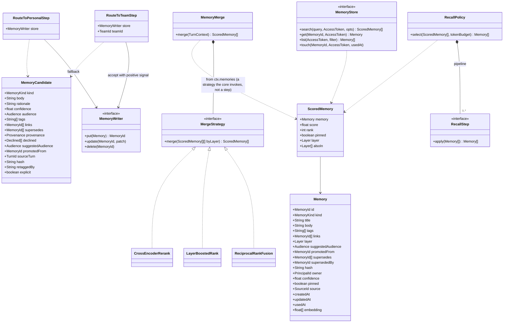
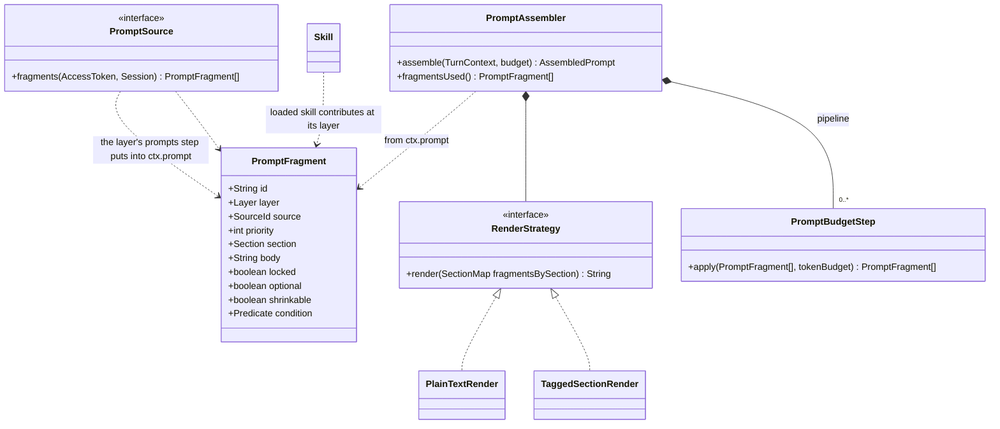
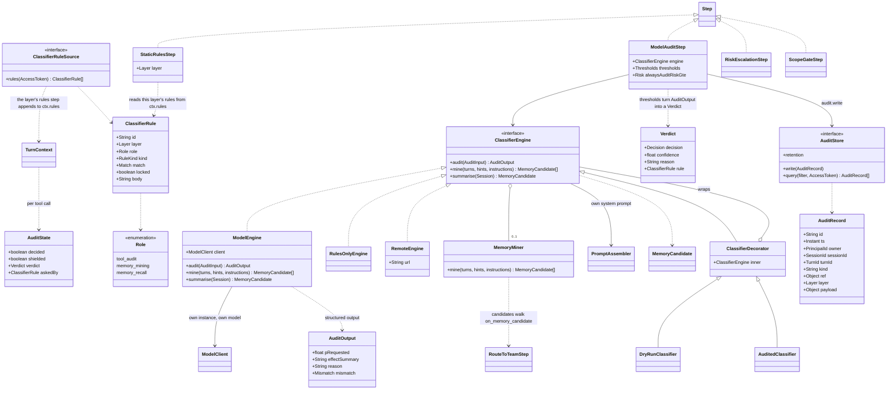
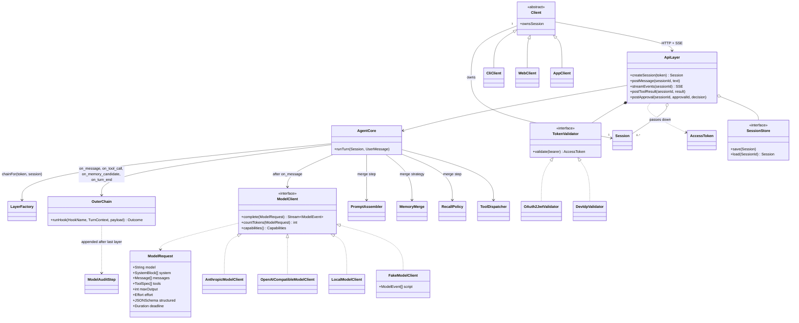

# Object model (UML class diagrams)

Mermaid `classDiagram` blocks; most Markdown viewers render them. Names
match `01-core-abstractions.md`, `07-turn-pipeline.md`, and
`08-walkthrough.md`. Where this note and the walkthrough differ, the
walkthrough is authoritative and this note is kept in sync.

Conventions: `<<interface>>` is a port the core depends on; concrete
adapters are examples, not a fixed list. `*--` composition, `o--`
aggregation, `..>` dependency, `<|..` realizes, `<|--` extends.

## 1. Identity, layers, session

## 2. The turn pipeline: a chain of chains

An outer chain of `Layer`s; each layer has, per hook point, an inner
chain of `Step`s. Steps read and append to the `TurnContext`
(`07-turn-pipeline.md`). `AccessToken` is the validated OAuth2 token;
there is no other identity object.

```mermaid
classDiagram
    class TurnContext {
        +AccessToken token
        +Session session
        +UserMessage inbound
        +Map~String,PromptFragment~ prompt
        +Map~String,SkillSummary~ skills
        +Map~String,ToolDefinition~ tools
        +ClassifierRule[] rules
        +ScoredMemory[] memories
        +ModelOutput modelOutput
        +Map~String,AuditState~ audit
        +MemoryCandidate[] candidates
        +Map~String,PendingApproval~ pendingApprovals
        +Map~String,ToolHandle~ runningTools
        +ToolCall[] callsThisTurn
        +RecallQuery recallQuery
        +DiscoverQuery discoverQuery
        +Memory[] recalled
        +AssembledPrompt assembled
        +boolean promptDirty
        +boolean memoriesDirty
        +Map~String,Layer[]~ shadowLog
        +Path workspace
        +TurnId turnId
        +put(accumulator, key, value, locked) boolean
        +snapshot() TurnSnapshot
    }
    class AuditState {
        +boolean decided
        +boolean shielded
        +Verdict verdict
        +ClassifierRule askedBy
        +String[] trace
    }
    class OuterChain {
        +Layer[] layers
        +runHook(HookName, TurnContext, payload) Outcome
    }
    class Layer {
        +String name
        +int position
        +Section[] allowedSections
        +boolean mayLock
        +Map~HookName,InnerChain~ hooks
        +run(HookName, TurnContext, payload) Outcome
    }
    class InnerChain {
        +Step[] steps
        +run(TurnContext, payload) Outcome
    }
    class HookName {
        <<enumeration>>
        on_message
        on_tool_call
        on_memory_candidate
        on_turn_end
    }
    class Step {
        <<interface>>
        +StepKind kind
        +run(TurnContext, payload) Outcome
    }
    class StepKind {
        <<enumeration>>
        gating
        contributing
        consuming
    }
    class ContributingStep {
        <<abstract>>
        +fetch(TurnContext, payload) Object
        +apply(TurnContext, Object)
    }
    class ConsumingStep {
        <<abstract>>
        +run(TurnContext, MemoryCandidate) Outcome
    }
    class Outcome {
        <<abstract>>
    }
    class Continue
    class Stop {
        +Action action
    }
    class Action {
        <<abstract>>
    }
    class Deny {
        +String reason
    }
    class Respond {
        +String text
    }
    class RequireApproval {
        +ApprovalRequest request
    }
    class GateStep
    class PromptFragmentsStep {
        +PromptSource source
    }
    class SkillDiscoveryStep {
        +SkillStore source
    }
    class ToolDefinitionsStep {
        +ToolSource source
    }
    class MemorySearchStep {
        +MemoryStore source
    }
    class RuleLoadStep {
        +ClassifierRuleSource source
    }
    class StaticRulesStep
    class RouteToTeamStep {
        +MemoryWriter store
    }
    class RouteToPersonalStep {
        +MemoryWriter store
    }
    class ModelAuditStep {
        +ClassifierEngine engine
    }
    class SkillAutoLoadStep
    class LoadedSkillsStep
    class MiningRetagStep
    class ScratchAcceptStep
    class SessionInstructionsStep
    class ClientToolsStep
    class SessionRulesStep
    class SessionScratchStep
    class FlagStep
    class StepDecorator {
        +Step inner
    }
    class TimedStep
    class FailOpenStep
    class FailClosedStep
    class RequiredStep
    class DryRunStep
    class LayerFactory {
        +forEntry(LayerConfig, AccessToken) Layer
        +chainFor(AccessToken, Session) OuterChain
    }
    class StepFactory {
        +register(stepName, ctor)
        +create(stepName, source, config) Step
    }
    class SourceFactory {
        +register(adapterName, ctor)
        +create(kind, adapterName, config) Source
    }

    OuterChain o-- "1..*" Layer : trust order
    Layer *-- "1..4" InnerChain : one per hook
    Layer ..> HookName
    InnerChain o-- "0..*" Step : configured order
    OuterChain ..> TurnContext
    Step ..> TurnContext : reads and appends
    Step ..> Outcome
    Outcome <|-- Continue
    Outcome <|-- Stop
    Stop --> Action
    Action <|-- Deny
    Action <|-- Respond
    Action <|-- RequireApproval
    Action <|-- Accepted
    Action <|-- Discarded
    Step <|.. ContributingStep
    Step <|.. ConsumingStep
    ConsumingStep <|-- RouteToTeamStep
    ConsumingStep <|-- RouteToPersonalStep
    ConsumingStep <|-- ScratchAcceptStep
    Step ..> StepKind
    Step <|.. SkillAutoLoadStep
    Step <|.. LoadedSkillsStep
    Step <|.. MiningRetagStep
    Step <|.. SessionInstructionsStep
    Step <|.. ClientToolsStep
    Step <|.. SessionRulesStep
    Step <|.. SessionScratchStep
    Step <|.. FlagStep
    StepDecorator <|-- FailClosedStep
    StepDecorator <|-- RequiredStep
    Step <|.. GateStep
    Step <|.. PromptFragmentsStep
    Step <|.. SkillDiscoveryStep
    Step <|.. ToolDefinitionsStep
    Step <|.. MemorySearchStep
    Step <|.. RuleLoadStep
    Step <|.. StaticRulesStep
    Step <|.. ModelAuditStep
    Step <|.. StepDecorator
    StepDecorator o-- Step : wraps
    StepDecorator <|-- TimedStep
    StepDecorator <|-- FailOpenStep
    StepDecorator <|-- DryRunStep
    LayerFactory ..> Layer : creates
    LayerFactory ..> OuterChain : builds per token
    LayerFactory --> StepFactory
    StepFactory --> SourceFactory
    StepFactory ..> Step : creates and decorates
```

Which steps run at which hook (standard set):

| Hook                  | Steps                                                                 |
|-----------------------|-----------------------------------------------------------------------|
| `on_message`          | GateStep (gating), PromptFragmentsStep, SkillDiscoveryStep, SkillAutoLoadStep, LoadedSkillsStep (implicit), ToolDefinitionsStep, MemorySearchStep, RuleLoadStep (contributing); session layer: SessionInstructionsStep, ClientToolsStep, SessionRulesStep, SessionScratchStep |
| `on_tool_call`        | RiskEscalationStep + ScopeGateStep (service, first); StaticRulesStep per layer; ModelAuditStep (service, last) |
| `on_memory_candidate` | MiningRetagStep (contributing) + RouteToTeamStep (consuming) in team layers, RouteToPersonalStep (consuming) in the user layer, ScratchAcceptStep (consuming) in the session layer; restrictive mining rules run once before this hook |
| `on_turn_end`         | FlagStep (a layer may emit `turn_flagged`); audit persistence is the service's AuditLogListener, not a step |

Precedence per accumulator on `put`:

| Accumulator     | Rule                                                     |
|-----------------|----------------------------------------------------------|
| prompt (by id)  | later step overwrites unless existing value is locked    |
| skills (by name)| same                                                     |
| tools (by name) | same; skill tools are namespaced so they only add        |
| rules           | append in layer order; each layer's step reads its own; restrictive kinds accumulate, locked allow shields |
| memories        | append; merged by `MergeStrategy` after `on_message`     |

## 3. Skills and tools

## 4. Memory

## 5. System prompt

## 6. Classifier

## 7. Agent core, API, and clients

## Shared vs. per-session, at a glance

| Shared (one per service)                          | Per session / per turn               |
|---------------------------------------------------|--------------------------------------|
| all `Source`s, `Layer`s and their `Step`s (cached per layer/team) | `Session`, `Conversation`, `EventBus` |
| `ClassifierEngine`, `ModelAuditStep`              | `AccessToken` (validated per request)|
| `LayerFactory`, `StepFactory`, `SourceFactory`, `ToolRunnerFactory` | `OuterChain` (built per token) |
| `PromptAssembler`, `MemoryMerge`, `ModelClient`, `AuditStore`, `SecretsProvider` | `TurnContext` and its accumulators |

## Viewing

The diagrams render inline in JetBrains IDEs with the Mermaid plugin, in
VS Code with a Mermaid preview extension, and on GitHub/GitLab. No
pre-rendered copies are kept; the Mermaid source in this file is the
single version.
